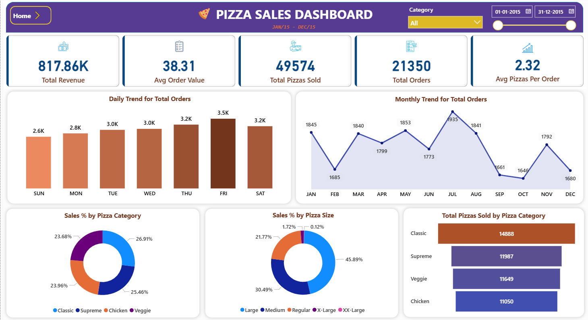
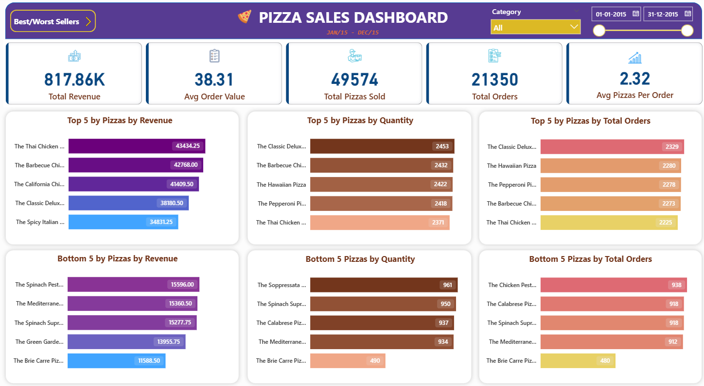

### Pizza_Sales_Analysis

### Project Overview

This project involved the development of an interactive Pizza Sales Dashboard to analyze business performance using real sales data. The aim was to provide management with actionable insights about key sales metrics, ordering trends, product performance, and customer preferences.

### Objectives

- Track overall business performance using relevant KPIs:
  - Total Revenue
  - Average Order Value
  - Total Pizzas Sold
  - Total Orders
  - Average Pizzas Per Order

- Visualize trends and breakdowns to highlight sales hot spots, product popularity, and inventory optimization opportunities.

### Data Preparation

- Imported cleaned pizza sales data containing order details (date, pizza type/category/size, quantity, price, etc.).
- Processed and aggregated key fields for accurate KPI calculation and trend analyses.

### Dashboard Implementation

#### KPI Cards
- Summarized vital business statistics at a glance, including total revenue, order value, pizzas sold, order count, and average pizza count per order.

#### Trend Charts
- **Daily Trend for Total Orders:**  
  Bar chart reveals weekly sales patterns and identifies high-traffic days (especially Friday and Saturday).
- **Monthly Trend for Total Orders:**  
  Line chart uncovers seasonal/periodic fluctuations and off-peak periods.

#### Sales Distribution Visualizations
- **By Category:**  
  Pie and bar charts show % and volume distribution across Classic, Supreme, Veggie, and Chicken, highlighting best and worst performers.
- **By Size:**  
  Pie chart indicates customer size preferences, critical for inventory and production planning.

#### Best/Worst Seller Analysis
- **Top 5 & Bottom 5:**  
  Visualized by revenue, quantity sold, and order count (bar charts) to identify products that drive sales and ones that are underperforming.

### Why Each Step Was Done

- **KPI Calculation:**  
  To provide quick, at-a-glance performance snapshots for stakeholders.
- **Trend Analysis:**  
  To identify profitable time periods and optimize marketing or inventory efforts.
- **Category/Size Distribution:**  
  To understand customer preferences and inform product development or promotional decisions.
- **Product Performance:**  
  To maximize sales of bestsellers and address/remove poor performers, driving overall profitability.

### Results & Insights

- Most orders occur on weekends—weekend campaigns can boost sales further.
- Large pizzas and Classic/Supreme categories are customer favorites.
- Certain variants have low traction, providing an opportunity to reimagine or replace them.

## Sample GitHub README.md

```markdown
# 🍕 Pizza Sales Dashboard

## Overview

This repository contains an interactive dashboard for analyzing pizza sales data. The dashboard provides insights into business performance, sales trends, product popularity, and customer preferences to empower data-driven decisions.

## Features

- **Business KPIs**
  - Total Revenue
  - Average Order Value
  - Total Pizzas Sold
  - Total Orders
  - Average Pizzas Per Order

- **Trend Analysis**
  - Daily trend for total orders (bar chart)
  - Monthly trend for total orders (line chart)

- **Product Breakdown**
  - Sales percentage by pizza category (pie/bar charts)
  - Sales percentage by pizza size (pie chart)
  - Total pizzas sold by category (bar chart)

- **Best/Worst Sellers**
  - Top 5 and Bottom 5 pizzas by revenue, quantity, and order count

## Screenshots




## Installation & Usage

1. **Clone the Repository:**
   ```
   git clone https://github.com/BalaSuriyaR/Pizza_Sales_Analysis.git
   cd Pizza_Sales_Analysis
   ```

2. **Open the Dashboard:**
   - Open the provided Power BI file (`PizzaSalesDashboard.pbix`) in Power BI Desktop  
     _or_  
   - Open the Excel file in Excel if using an Excel dashboard

3. **Add or Refresh Data:**
   - Replace the sample dataset with your sales data if needed

4. **Explore the Dashboard:**
   - Navigate through tabs to review KPIs, trends, and product performance

## Project Structure

```
pizza-sales-dashboard/
├── data/
│   └── pizzasalesdata.csv
├── dashboard/
│   └── PizzaSalesDashboard.pbix
├── screenshots/
│   └── dashboard_main.png
│   └── best_worst_sellers.png
├── README.md
```

## Insights

- Most sales occur on weekends, with Large size pizzas being the most popular.
- Classic and Supreme categories drive the highest sales volume.
- Targeted campaigns during low sales months and on underperforming products can help boost revenue.

```

Let me know if you’d like any specific customization or additional sections!
